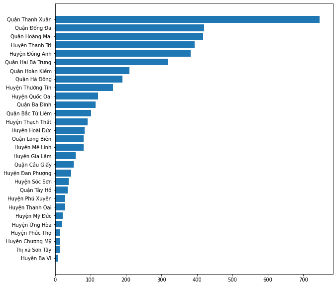
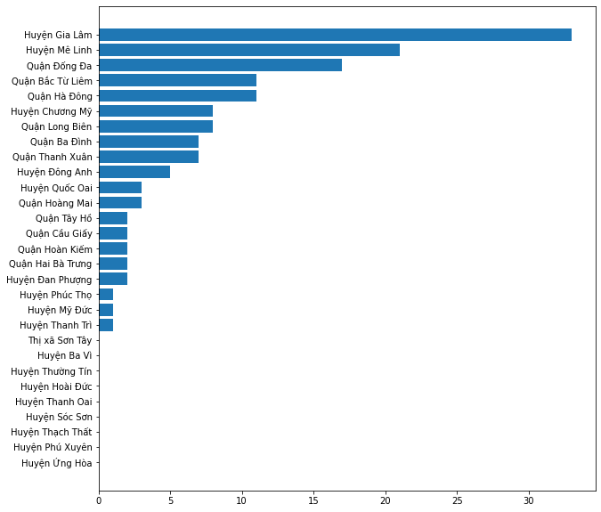
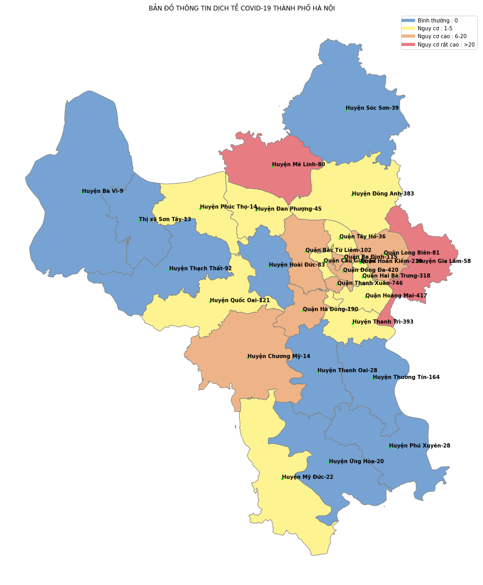
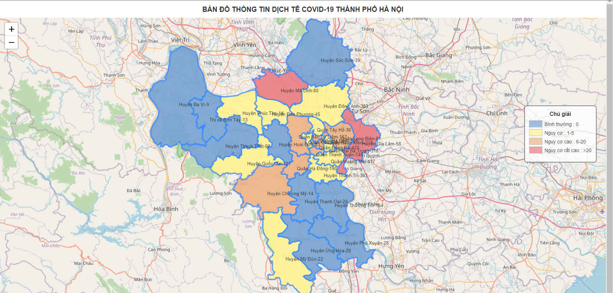

# COVID-19-HaNoi-GIS
Bản đồ thông tin dịch tễ covid-19 thành phố Hà Nội Được xây dựng trên 2 bộ dữ liệu là bộ dữ liệu GIS Hà Nội và bộ dữ liệu thống kê số ca mắc covid-19 trên địa bàn hà nội được ghi lại Từ ngày 29/04/2021 đến 17:24 giờ, ngày 05/11/2021.
Dựa vào số ca mắc covid-19 ta chia làm 4 mức độ để thể hiện màu sắc từng quận huyện:
  - Bình thường : 0 được thể hiện bằng màu xanh dương
  - Nguy cơ : 1-5 được thể hiện bằng màu vàng nhạt
  - Nguy cơ cao : 6-20 được thể hiện bằng màu cam sữa
  - Nguy cơ rất cao : >20 được thể hiện bằng màu hồng

**Thống kê số ca dương tính trên địa bàn Thành phố Hà Nội**

**(Từ ngày 29/04/2021 đến 17:24 giờ, ngày 05/11/2021)**

**Số ca dương tính Covid 19 lây nhiễm trong cộng đồng được công bố trong vòng 14 ngày so với ngày hiện tại.**

**BẢN ĐỒ THÔNG TIN DỊCH TỄ COVID-19 THÀNH PHỐ HÀ NỘI**

